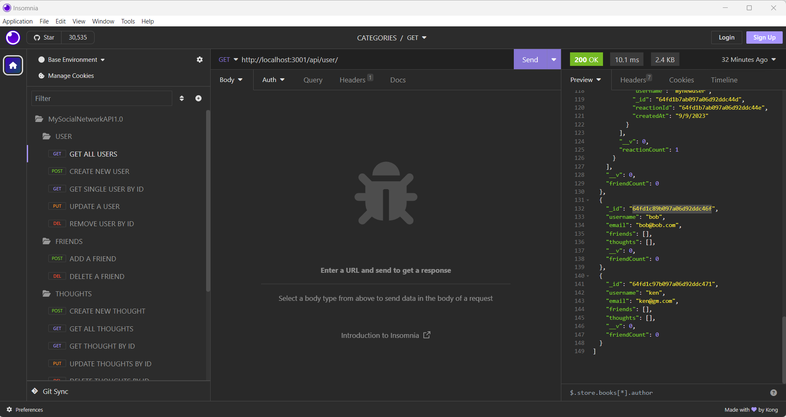
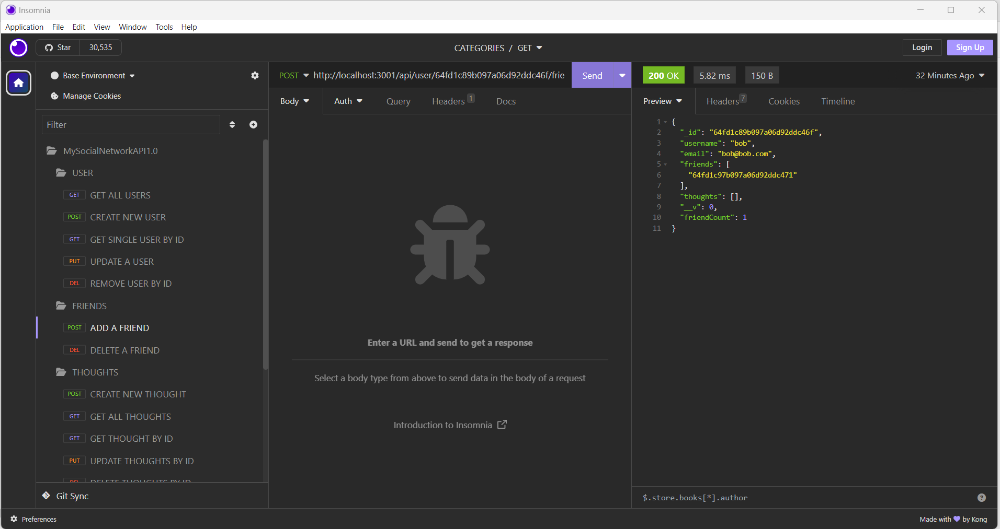
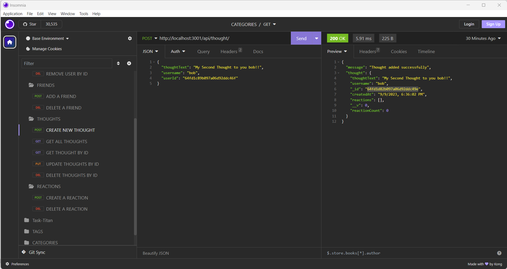
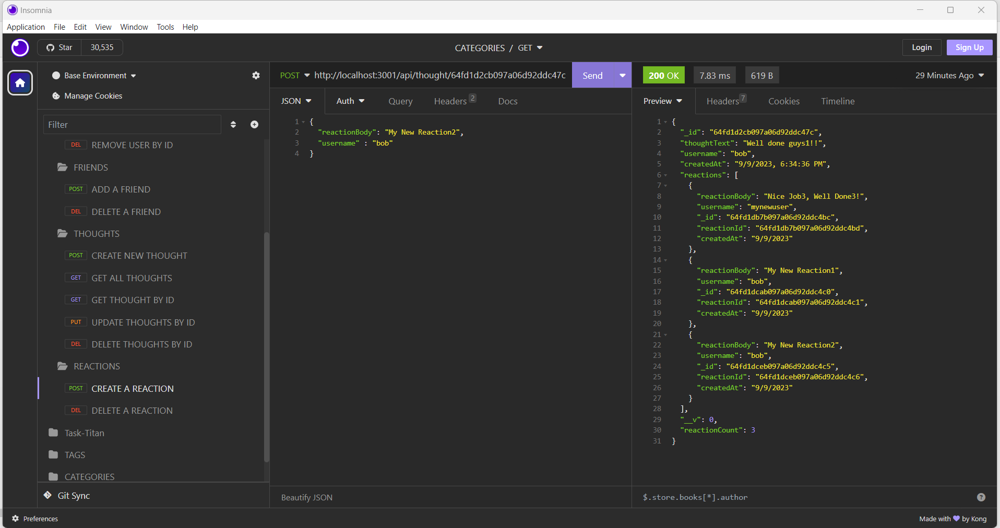

# MySocialNetworkAPI1.0
[](https://opensource.org/licenses/MIT)

## **MySocialNetworkAPI1.0: NoSQL: Social Network API**

---

### **Social Network API**

   The Social Network API is a backend platform designed to simulate the fundamental operations of a social networking site. It is built on a robust tech stack including Node.js, Express, Mongoose, and is actively watched by Nodemon for development purposes. Here's a breakdown of its components and features:

---
#### **Tech Stack:**

- **Node.js:** An open-source, cross-platform JavaScript runtime environment, facilitating the backend development.
  
- **Express:** A minimal, unopinionated Node.js web application framework that provides a set of robust features to develop web and mobile applications.

- **Mongoose:** A MongoDB object modeling tool used to manage relationships between data, provide schema validation, and translate between objects in code and their representation in MongoDB.

- **Nodemon:** A utility that monitors for any changes in the source code and automatically restarts the server. It is particularly useful during the development phase for a quicker iterative process.

#### **Features:**

1. **User Management:**
   - **Registration:** Users can register with a unique username and email address.
   - **Profile Management:** Users can update their profile details.
   - **User Deletion:** Account holders have the ability to delete their profiles.
   - **Friend Management:** Users can add or remove others from their friends list.

2. **Thoughts & Reactions:**
   - **Post Thoughts:** Users can share their thoughts, which are akin to 'posts' on mainstream platforms.
   - **React to Thoughts:** Users can react to thoughts, providing a layer of interaction between members.
   - **Manage Thoughts:** Thoughts can be updated or deleted by the user who posted them.

3. **Data Validation:**
   - The API ensures all data inputs, especially emails, are in the correct format using validation techniques.
   
4. **Error Handling:**
   - In the event of an unexpected error, the API is equipped to handle and relay user-friendly error messages.
   
5. **Cascade Delete:** 
   - A user's deletion leads to the subsequent removal of their thoughts and reactions, ensuring data consistency.

#### **Development & Deployment:**

- The API's development process is streamlined with the use of Nodemon, ensuring that changes are instantly reflected without a manual server restart.

- Express routes are structured to adhere to RESTful principles, making the API intuitive and easily expandable in the future.

- Mongoose interacts with MongoDB, allowing for structured schemas, efficient data storage, and retrieval processes.

---

   The Social Network API offers a strong foundation for any frontend platform aiming to emulate basic social networking features. Its modularity and structured build mean it can be expanded upon with ease, catering to a more extensive set of functionalities as the platform grows.

---

  ## Table of Contents
  - [Installation](#installation)
  - [Usage](#usage)
  - [Testing](#testing)
  - [Packages Used](#package-list)
  - [Deployed Link](#deployed-link)
  - [Sample Application](#sample-application)
  - [License](#license)
  - [Questions](#questions)
  ## Installation <a name="installation"></a>

### **Setting up the Social Network API**

#### **1. Initial Setup**

Make sure you have Node.js installed. If not, download and install it from [Node.js official site](https://nodejs.org/).

#### **2. Setting Up a New Node.js Project**

- Create a new directory for your project:
  ```bash
  mkdir social-network-api
  cd social-network-api
  ```

- Initialize a new Node.js project:
  ```bash
  npm init -y
  ```

#### **3. Installing Required Packages**

- Install Express for your server:
  ```bash
  npm install express
  ```

- Install Mongoose for MongoDB object modeling:
  ```bash
  npm install mongoose
  ```

- Install Nodemon for development (it will automatically restart your server on changes):
  ```bash
  npm install nodemon --save-dev
  ```

#### **4. Configuring Nodemon**

- In your `package.json` file, add the following to the "scripts" section:
  ```json
  "start": "nodemon ./path_to_your_entry_file.js"
  ```
  Replace `path_to_your_entry_file.js` with the path to your main server file, e.g., `server.js` or `index.js`.

#### **5. Setting Up MongoDB**

- Ensure you have MongoDB installed. If not, follow the [official installation guide](https://docs.mongodb.com/manual/installation/).

- Once installed, you can start MongoDB by running:
  ```bash
  mongod
  ```

#### **6. Connecting to MongoDB using Mongoose**

In your main server file (e.g., `server.js`):

```javascript
const express = require('express');
const mongoose = require('mongoose');

const app = express();

// Connect to MongoDB
mongoose.connect('mongodb://localhost:27017/socialNetworkDB', {
    useNewUrlParser: true,
    useUnifiedTopology: true
});

mongoose.connection.once('open', () => {
    console.log('Connected to MongoDB');
});

//... Your routes and other configurations ...

const PORT = process.env.PORT || 3000;
app.listen(PORT, () => {
    console.log(`Server is running on port ${PORT}`);
});
```

#### **7. Building Your API**

Now, you can begin building your routes, controllers, and models for the User, Thoughts, Reactions, etc., based on your requirements.

#### **8. Running Your API**

Once everything is set up, you can start your server with:

```bash
npm start
```

This will use Nodemon to start your server, and any changes you make will automatically restart the server.

---

And that's it! You now have a basic setup for a Social Network API using Mongoose, Node.js, Express, and Nodemon.

## Usage <a name="usage"></a>
 ---
Certainly! Here's a guide on how to use the Social Network API:

### **Usage Guide for the Social Network API**

#### **1. Starting the API**

Before interacting with the API, ensure it's running:

```bash
npm start
```

#### **2. API Endpoints and Their Functions**

Here's a sample breakdown of possible API endpoints and how to use them:

**Note:** We'll use `curl` for demonstration purposes, but you can use any HTTP client like Postman, Insomnia, or even front-end applications to make these requests.

- **Create a User**

  ```bash
  curl -X POST -H "Content-Type: application/json" -d '{"username": "john_doe", "email": "john@example.com"}' http://localhost:3000/api/users
  ```

- **Retrieve All Users**

  ```bash
  curl http://localhost:3000/api/users
  ```

- **Retrieve a User by ID**

  ```bash
  curl http://localhost:3000/api/users/:userId
  ```

  Replace `:userId` with the actual ID of the user.

- **Update a User by ID**

  ```bash
  curl -X PUT -H "Content-Type: application/json" -d '{"username": "john_updated"}' http://localhost:3000/api/users/:userId
  ```

  Again, replace `:userId` with the actual ID of the user.

- **Delete a User by ID**

  ```bash
  curl -X DELETE http://localhost:3000/api/users/:userId
  ```

  Make sure to replace `:userId` with the user's actual ID.

- **Add a Friend to a User**

  ```bash
  curl -X POST -H "Content-Type: application/json" -d '{"friendId": ":friendId"}' http://localhost:3000/api/users/:userId/friends
  ```

  Replace `:userId` with the user's ID and `:friendId` with the friend's ID.

- **Remove a Friend from a User**

  ```bash
  curl -X DELETE http://localhost:3000/api/users/:userId/friends/:friendId
  ```

  Swap out `:userId` and `:friendId` with appropriate IDs.

- **Creating Thoughts, Adding Reactions, etc.**

  You would follow similar steps as above for thoughts and reactions, adjusting the endpoints and payload based on the operation.

#### **3. Error Handling**

If you receive a `500 Internal Server Error` when making requests, check the server logs for specific error messages. This will help you understand if there's an issue with the database, a missing field, or some other problem.

#### **4. Development**

Remember, with Nodemon, any changes you make to your server code will trigger a server restart. So, you can continue developing and testing simultaneously.

### **Testing with Front-End**

If you develop a front-end application (e.g., using React, Angular, Vue, etc.), you can integrate it with your API. Use the provided endpoints to perform CRUD operations and display data on your website or app.

---

That's a basic usage guide for your Social Network API. Remember, this is a general overview, and the actual usage may vary based on the specific features and functionalities you've implemented in your API.

## Testing <a name="testing"></a>

### **Validation Steps for Social Network API Using Insomnia**

#### **1. Setting Up Insomnia**

- **Download and Install**
  If you haven’t already, download and install Insomnia from their [official website](https://insomnia.rest/).

- **Launch Application**
  After installation, open Insomnia.

#### **2. Create a New Request**

- Click on the **"New"** button (usually located at the top-left).
- Choose **"Request"**.
- Give your request a descriptive name, e.g., `Get All Users`.
- Choose the request type. Start with `GET` if you're retrieving data.
- Click on the **"Create"** button.

#### **3. Define API Endpoint**

- Enter your API endpoint in the URL bar. For instance, if you're testing a local server, it might look like `http://localhost:3000/api/users`.

#### **4. Set Headers (if required)**

- Click on the `Headers` tab.
- For most of your API calls that send or receive JSON data, you'd set:
  - `Content-Type` to `application/json`.

#### **5. Add Request Body (for POST, PUT)**

- Click on the `Body` tab.
- If you're sending JSON data (e.g., when creating a user), choose `JSON` and input your JSON data:
  ```json
  {
      "username": "john_doe",
      "email": "john@example.com"
  }
  ```

#### **6. Send the Request**

- Click on the **"Send"** button. 
- Inspect the results in the right panel. You should see a status code and a response body.

#### **7. Further Testing**

- To test different endpoints or request types, repeat the steps above.
- For endpoints that require specific user IDs or parameters, adjust the URL as needed, e.g., `http://localhost:3000/api/users/:userId`.

- Test error scenarios as well. For example, try creating a user without a mandatory field and ensure the error response is as expected.

#### **8. Save Your Requests**

- Insomnia allows you to save your requests. This is particularly useful for repetitive testing. Save various request scenarios and revisit them when needed.

#### **9. Organize Your Requests**

- You can create workspaces and organize related requests into folders, e.g., all `User-related` endpoints in one folder, and `Thought-related` in another.

#### **10. Validate Responses**

- Ensure the data returned is correct.
- Check for appropriate HTTP status codes. (e.g., `200 OK` for successful GET requests, `201 Created` for successful POST requests, etc.)
- Validate error scenarios. If you're purposely sending a bad request, ensure the error messages are descriptive and useful.

#### **11. Advanced Testing**

- If your API uses authentication, you can set up authentication headers or use Insomnia's built-in authentication options.
- Use Insomnia's environment variables feature if you're switching between different environments (like development, staging, production).

---

By following these steps, you can comprehensively test your Social Network API and ensure it's behaving as expected. If you come across any unexpected behavior or errors, consult your server logs or application code to troubleshoot.
 
## Packages Used <a name="package-list"></a>
---


For building a Social Network API using Mongoose, Node.js, Express, and Nodemon, the following packages would typically be used:

1. **express**: The core framework for building the web server and handling HTTP requests and responses.

    Installation:
    ```bash
    npm install express
    ```

2. **mongoose**: An Object Data Modeling (ODM) library for MongoDB and Node.js. It helps manage relationships between data and provides schema validation.

    Installation:
    ```bash
    npm install mongoose
    ```

3. **nodemon**: A utility that monitors changes in your source code and automatically restarts the server, making development more efficient.

    Installation:
    ```bash
    npm install nodemon --save-dev
    ```

    Note: It's typically installed as a dev dependency since it's not needed in a production environment.

These are the foundational packages that one would typically use in such a project. Depending on the specifics of your project, there might be additional packages that are relevant, such as validation libraries, other middleware, etc.

After installing these packages, they should be `require`d at the top of your main server file (often named `server.js` or `index.js`) and utilized accordingly in your application logic.


## Deployed Link <a name="deployed-link"></a>
Code Review Video: https://drive.google.com/file/d/1WdO8-Q01vdtRiY33_RydXek8Fb33kbyS/view
Insomnia Demo: https://drive.google.com/file/d/1wkx_3reWVH4tSLu5XwWUXvJ4ua9LOuY2/view

  ## Sample Application <a name="sample-application"></a>
  
  
  
  
  
  

## License <a name="license"></a>
  This project is licensed under the MIT license.
  https://opensource.org/licenses/MIT

  ## Questions <a name="questions"></a>
  If you have any questions, please contact me at arun@arun.com. 
  
  My GitHub profile is [arundvp](https://github.com/arundvp).